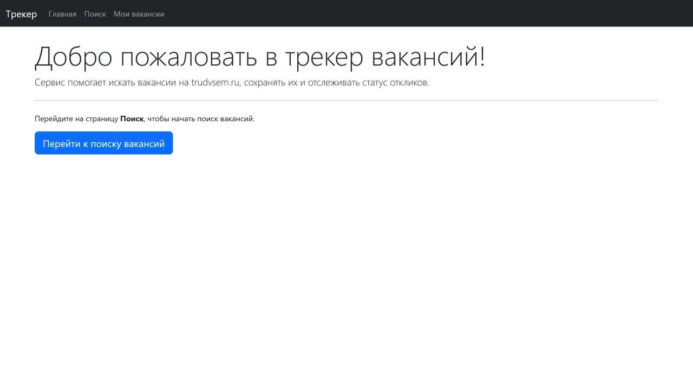
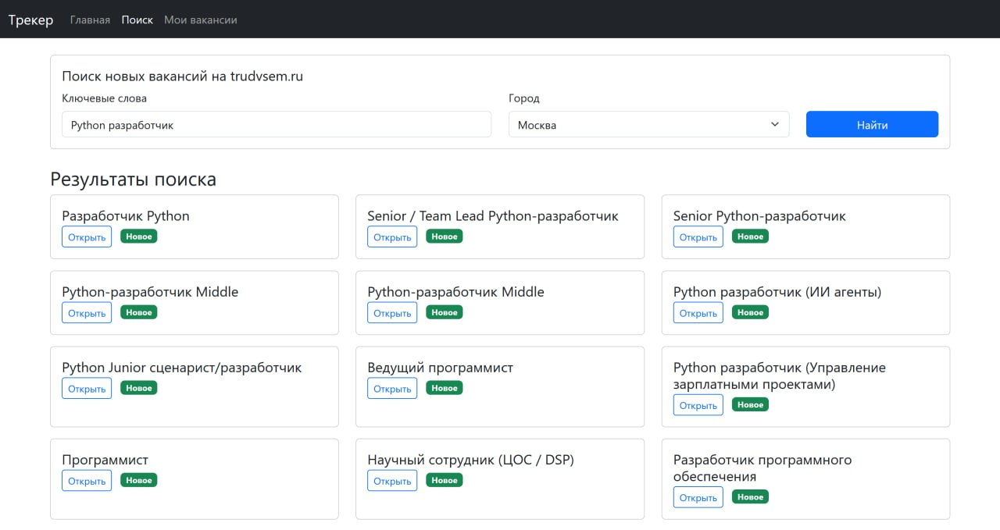

# Трекер вакансий (Vacancy Tracker)

Веб-приложение для поиска и отслеживания вакансий с использованием открытого API портала «Работа России» (trudvsem.ru). Позволяет находить актуальные вакансии, сохранять их в личную базу данных, управлять статусами откликов, сортировать и удалять записи.

---

## 🛠️ Технологический стек

- **Backend**: Python 3.11, FastAPI, SQLAlchemy, Alembic
- **Database**: SQLite
- **Frontend**: HTML5, Bootstrap 5, JavaScript
- **API**: Trudvsem (публичный, без токенов)
- **Дополнительно**: Uvicorn, httpx, loguru, Pydantic

---

## ✨ Функциональные возможности

- 🔍 **Поиск вакансий** по ключевым словам и региону (Москва, СПб, Новосибирск, Краснодар)
- 💾 **Автоматическое сохранение** найденных вакансий в базу данных (без дубликатов)
- 📋 **Отдельная страница «Мои вакансии»** со всеми сохранёнными записями
- 🏷️ **Управление статусами** (new → favorite → applied → interview → rejected → offer)
- 🔎 **Фильтрация по названию** в реальном времени
- 🗂️ **Сортировка** по названию, компании, статусу, дате добавления
- ✅ **Выборочное удаление** (с чекбоксами) и полная очистка списка
- 📄 **Детальный просмотр** вакансии в модальном окне (зарплата, опыт, график, описание)
- 🖱️ **Адаптивный интерфейс** на Bootstrap

---

## 🚀 Установка и запуск

### 1. Клонировать репозиторий

git clone https://github.com/ТВОЙ_ЛОГИН/tracker_vacancy.git
cd tracker_vacancy

### 2. Создать виртуальное окружение и активировать его

python -m venv venv
# Windows:
venv\Scripts\activate
# macOS/Linux:
source venv/bin/activate

### 3. Установить зависимости

pip install -r requirements.txt

Если файла requirements.txt нет, создайте его командой:

pip freeze > requirements.txt

### 4. Применить миграции базы данных

alembic upgrade head

### 5. Запустить сервер разработки

fastapi dev app/main.py

Приложение будет доступно по адресу:
http://127.0.0.1:8000

### 6. Открыть в браузере

- **Главная**: http://127.0.0.1:8000/static/index.html
- **Поиск вакансий**: http://127.0.0.1:8000/static/vacancies.html
- **Мои вакансии**: http://127.0.0.1:8000/static/my_vacancies.html

---

## 📁 Структура проекта

```
tracker_vacancy/
├── app/
│   ├── __init__.py
│   ├── main.py                 # точка входа, CORS, статика
│   ├── database.py             # подключение к БД (SQLite)
│   ├── models.py               # SQLAlchemy-модель Vacancy
│   ├── schemas.py              # Pydantic-схемы
│   ├── routers/
│   │   └── vacancies.py        # CRUD + поиск
│   └── services/
│       └── vacancy_service.py  # интеграция с trudvsem API
├── static/
│   ├── index.html              # главная страница
│   ├── vacancies.html          # страница поиска
│   └── my_vacancies.html       # страница моих вакансий
├── alembic/                    # миграции
├── alembic.ini
├── requirements.txt
└── README.md
```

---

## 🧪 Примеры запросов

**Поиск вакансий Python в Москве:**

GET /vacancies/search?query=python&area=1

**Обновить статус вакансии с id=5 на "applied":**

PATCH /vacancies/5
Content-Type: application/json

{"status": "applied"}

---

## 🖼️ Скриншоты:

### Главная страница


### Страница поиска с результатами


### Страница моих вакансий с сортировкой и модальным окном
.jpg)

---

## 🔮 Планы по улучшению

- Добавить пагинацию на страницу поиска и в список вакансий
- Реализовать экспорт отфильтрованных вакансий в CSV/PDF
- Добавить авторизацию (чтобы у разных пользователей были свои списки)
- Настроить асинхронное обновление вакансий через Celery + Redis
- Деплой на Koyeb/Render с PostgreSQL
- Переключиться с SQLite на PostgreSQL

---

## 📄 Лицензия

Проект распространяется под лицензией MIT. Подробности в файле [LICENSE](LICENSE).

---

## 📞 Контакты

Автор: [Никита Козинец]
GitHub: https://github.com/Nikhub03
